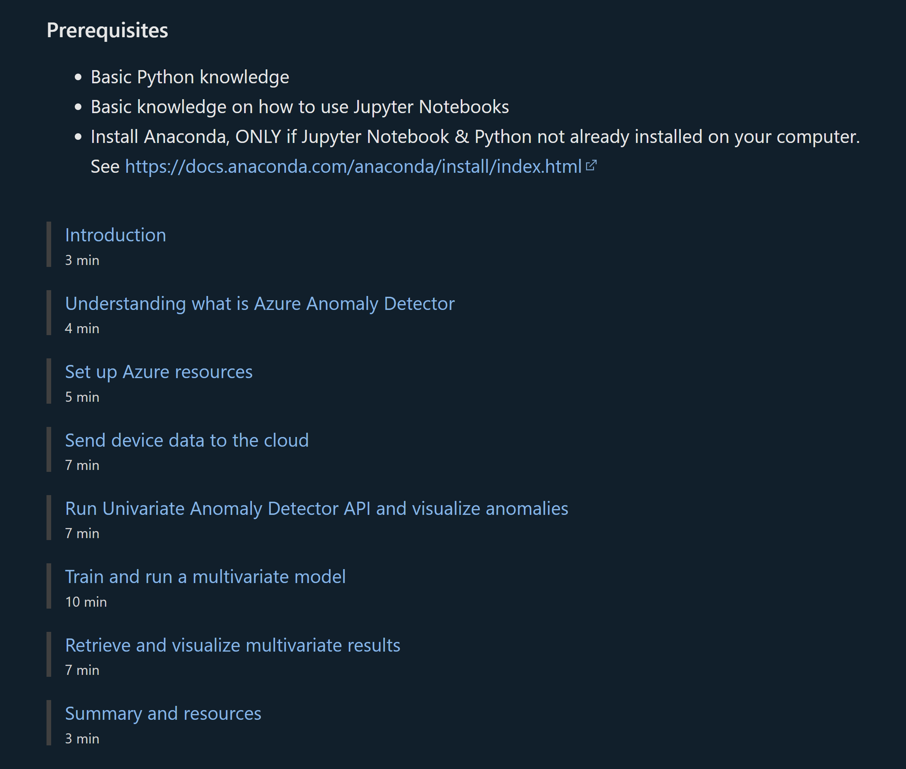

<h1 align="center">
  
</h1>

  👉Get your hands on Anomaly Detector on Day one, not one day!👈

---

## 👋About Anomaly Detector
[Anomaly Detector](https://learn.microsoft.com/en-us/azure/cognitive-services/anomaly-detector/overview) is an AI service with a set of APIs, which enables you to monitor and detect anomalies in your time series data with little ML knowledge, either batch validation or real-time inference.

[Univariate Anomaly Detection API](https://learn.microsoft.com/en-us/azure/cognitive-services/anomaly-detector/overview-univariate) enables you to monitor and detect abnormalities in your single variable without having to know machine learning. The Anomaly Detector API's algorithms adapt by automatically identifying and applying the best-fitting models to your data, regardless of industry, scenario, or data volume. Using your time series data, the API determines boundaries for anomaly detection, expected values, and which data points are anomalies.

[Multivariate anomaly detection API](https://learn.microsoft.com/en-us/azure/cognitive-services/anomaly-detector/overview-multivariate) further enable developers by easily integrating advanced AI for detecting anomalies from groups of metrics, without the need for machine learning knowledge or labeled data. Dependencies and inter-correlations between up to 300 different signals are now automatically counted as key factors. This new capability helps you to proactively protect your complex systems such as software applications, servers, factory machines, spacecraft, or even your business, from failures.

## 👉Getting Started

### 1️⃣Microsoft Learn - Anomaly Detector

- Learning module: [Identify abnormal time-series data with Anomaly Detector](https://learn.microsoft.com/en-us/training/modules/identify-abnormal-time-series-data-anomaly-detector/?WT.mc_id=data-12171-ruyakubu)
    
    

### 2️⃣API/SDK Sample
- [Anomaly Detector Sample](https://github.com/Azure-Samples/AnomalyDetector)
- [Anomaly Detector Sample in python notebook](https://github.com/Azure-Samples/AnomalyDetector/tree/master/ipython-notebook)

### 3️⃣Anomaly Detector in Synapse
- [Tutorial: Use Multivariate Anomaly Detector in Azure Synapse Analytics](https://learn.microsoft.com/en-us/azure/cognitive-services/anomaly-detector/tutorials/multivariate-anomaly-detection-synapse)
- [Sample notebook for MVAD in Synapse](https://github.com/jr-MS/MVAD-in-Synapse)

### 4️⃣Anomaly Detector in Azure Databricks
- [Blog: Detect Anomalies in Equipment with Anomaly Detector in Azure Databricks](https://techcommunity.microsoft.com/t5/ai-cognitive-services-blog/detect-anomalies-in-equipment-with-anomaly-detector-in-azure/ba-p/3390688)

### 5️⃣Anomaly Detector in Azure Data Explorer
- [Blog: Announcing Univariate Anomaly Detector in Azure Data Explorer](https://techcommunity.microsoft.com/t5/ai-applied-ai-blog/announcing-univariate-anomaly-detector-in-azure-data-explorer/ba-p/3285400)
- [Documentation about anomaly detection function in ADX](https://learn.microsoft.com/en-us/azure/data-explorer/kusto/functions-library/series-uv-anomalies-fl?tabs=adhoc)

### 6️⃣Anomaly Detector PowerBI
- [Anomaly Detection in PowerBI - UI](https://learn.microsoft.com/en-us/power-bi/visuals/power-bi-visualization-anomaly-detection)
- [Anomaly Detection in PowerBI - PowerQuery](https://learn.microsoft.com/en-us/azure/cognitive-services/anomaly-detector/tutorials/batch-anomaly-detection-powerbi)

## ❤️Support
Need support? [Join the Anomaly Detector Community](https://forms.office.com/pages/responsepage.aspx?id=v4j5cvGGr0GRqy180BHbR2Ci-wb6-iNDoBoNxrnEk9VURjNXUU1VREpOT0U1UEdURkc0OVRLSkZBNC4u).